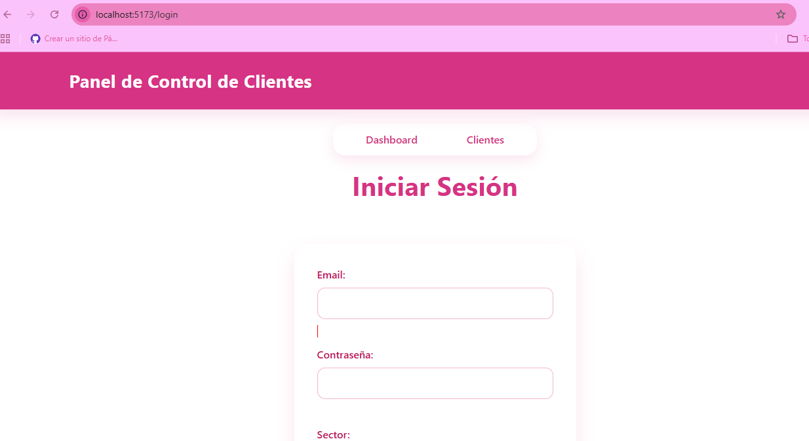
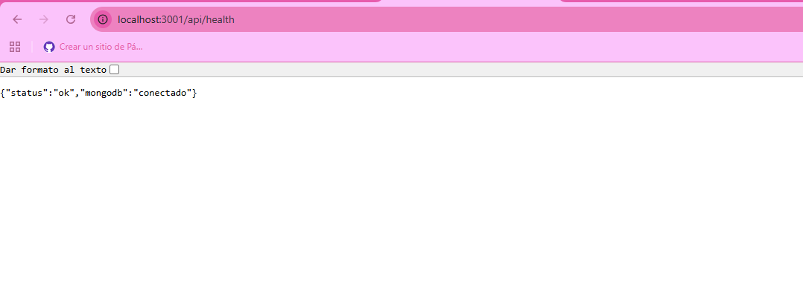
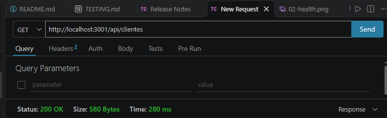
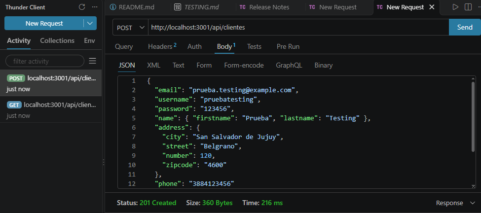
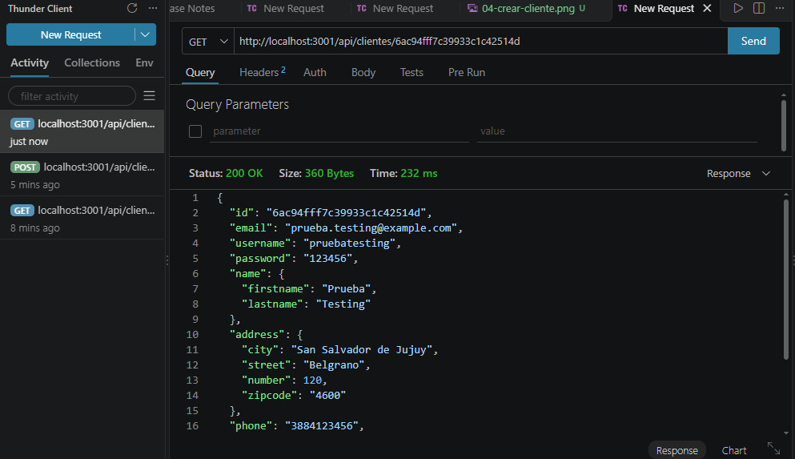
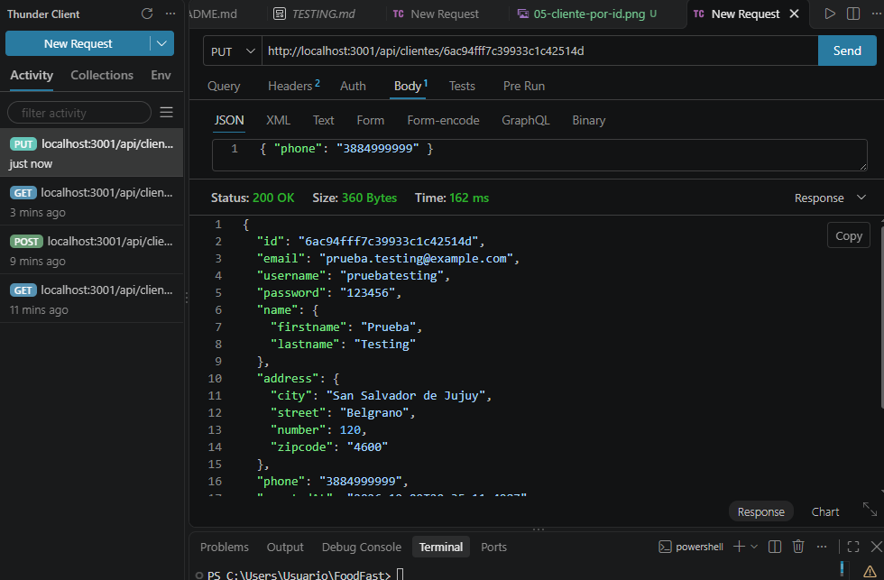
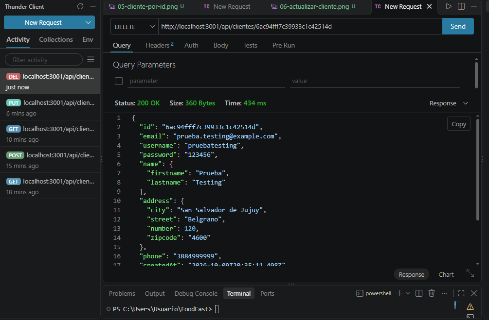
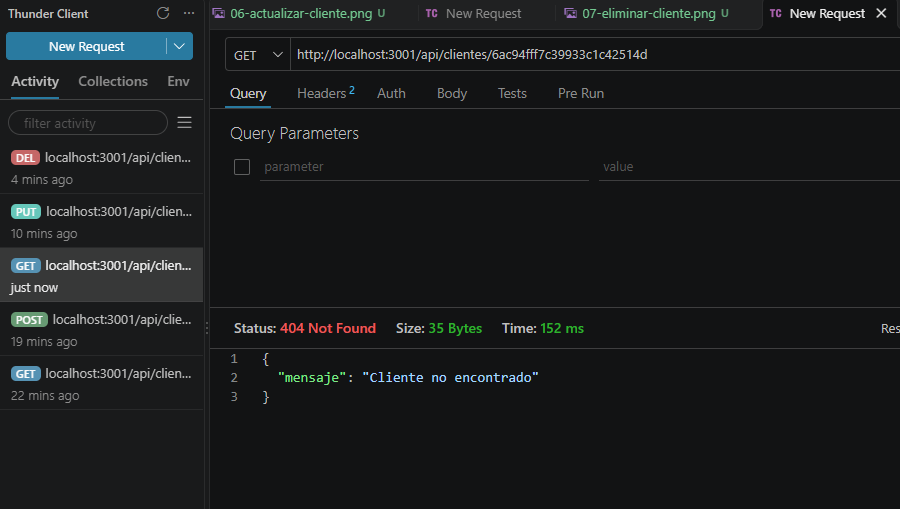
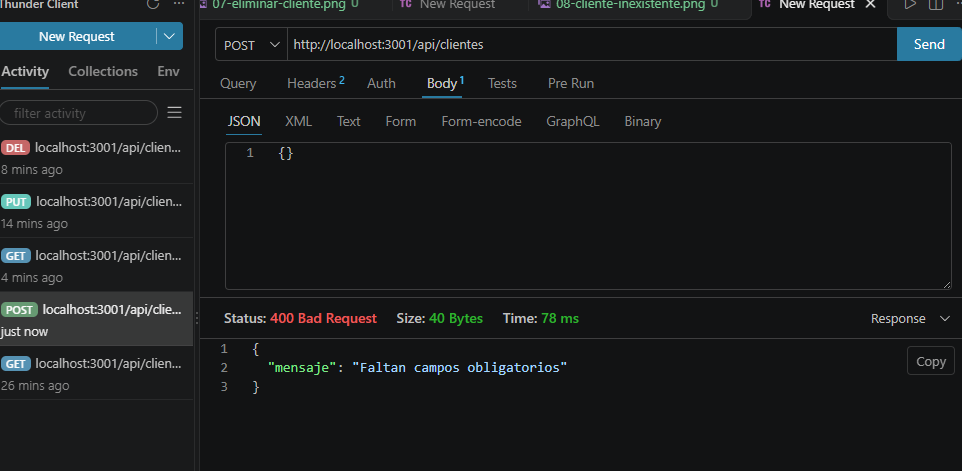

# Registro de pruebas

Pruebas del backend de FoodFast realizadas con Thunder Client (VS Code) contra el servidor local `http://localhost:3001`.

**Entorno:** Node.js + Express + MongoDB Atlas
**Responsable:** Sofía Verdeja

## Puntos de control

| Punto de control | Resultado | Captura |
|---|---|---|
| El frontend corre en `localhost:5173` sin errores | Aprobado |  |
| El servidor responde en `localhost:3001` | Aprobado |  |
| Los datos persisten en MongoDB Atlas | Aprobado |   |

## Pruebas de la API

| N° | Prueba | Método y URL | Resultado esperado | Resultado obtenido | Estado | Captura |
|---|---|---|---|---|---|---|
| 1 | Estado del servidor y la base | GET `/api/health` | `status: ok` y `mongodb: conectado` | `{"status":"ok","mongodb":"conectado"}` | Aprobado |  |
| 2 | Listar clientes | GET `/api/clientes` | Lista de clientes (puede estar vacía) | `200 OK`, lista con 1 cliente (Ana Pérez) | Aprobado |  |
| 3 | Crear cliente | POST `/api/clientes` | Devuelve el cliente creado con su `id` | `201 Created`, cliente "Prueba Testing" con su `id` | Aprobado |  |
| 4 | Obtener cliente por id | GET `/api/clientes/:id` | Devuelve el cliente creado en la prueba 3 | `200 OK`, devuelve "Prueba Testing" | Aprobado |  |
| 5 | Actualizar cliente | PUT `/api/clientes/:id` | Devuelve el cliente con el teléfono modificado | `200 OK`, teléfono actualizado a `3884999999` | Aprobado |  |
| 6 | Eliminar cliente | DELETE `/api/clientes/:id` | Elimina el cliente | `200 OK`, devuelve el cliente eliminado | Aprobado |  |
| 7 | Cliente inexistente | GET `/api/clientes/:id` con un id eliminado | Responde con error, no con un cliente | COMPLETAR | Aprobado |  |
| 8 | Crear sin campos obligatorios | POST `/api/clientes` con cuerpo vacío | Responde con error de validación | COMPLETAR | Aprobado |  |
| 9 | Persistencia | GET `/api/clientes` | Aparecen datos cargados antes por otro integrante desde otra máquina | Aparece el cliente Ana Pérez, cargado por el equipo | Aprobado |  |

## Observaciones

- La API devuelve el identificador como `id` (no `_id`).
- La respuesta del POST incluye el campo `password` sin cifrar. Se recomienda no guardar ni devolver contraseñas en texto plano. No se modificó el código por no formar parte de esta tarea; se comunicó al equipo.
- El DELETE devuelve el cliente eliminado en lugar de un mensaje de confirmación.
- `npm install` informa vulnerabilidades en las dependencias (3 en `server/`, 9 en `client/`). No se aplicaron correcciones para no modificar versiones del proyecto.
- Deploy: no realizado, a definir con el equipo.